# Facebook Recruiting IV: Human or Robot?
### Name : Leo

-------------------

# 定义
## 项目概览
随着互联网的发展，出现了提供各种服务的互联网产品，互联网竞拍平台便是其中之一，互联网竞价平台提供了一个虚拟的线上竞拍空间，使得商品持有人可以把所持商品放置到竞拍空间，让对其感兴趣的用户进行竞价购买。在竞拍过程中，用户可以进行多次竞价，使得商品竞拍价格可达到持有人预期或之上的价格。但随着机器人用户的进入，使得竞拍过程不再对真实用户不再公平，机器人可推高价格，迫使真实用户出更高的价格或放弃出价，从而打破竞拍的价格平衡，用户及平台都是极大的伤害。所以我们需要基于对平台所有用户基本数据及行为数据，找出潜在的机器人用户并剔除平台，使得竞拍过程回归公平。

此项目来自于kaggle[1]，kaggle平台提供了两项数据，一是包括用户的id、地址、支付方式的用户数据，二是平台每一次的竞价行为数据，我们将对这些数据进行处理、分析、训练、预测，发现潜在的机器人用户。
 
## 问题说明
项目目标是发现用户集合中的机器人用户，通过训练给定的用户数据，识别用户是否是机器人，这是一个监督学习的二分类问题。

这个项目中，我将
- 对数据进行探索及可视化分析，找到特征工程的方向。
- 对数据进行缺省值处理，字符串数字化。
- 由于用户数据特征数量过少，重点还将基于对竞价行为数据的处理，为用户数据增加特征。
- 而后对各个分类器进行训练，训练完成之后进行对比，找到最有效的分类器。
- 然后对分类器进行调参，找到最优参数组合。
- 通过auc面积对模型进行评估。


## 指标
对于二分类问题，，我们将使用下列指标：  
1. AUC：（ROC曲线下方的面积大小）来做模型的评估指标：理想指标值为1  
    统计一下所有的 M×N(M为正类样本的数目，N为负类样本的数目)个正负样本对中，有多少个组中的正样本的score大于负样本的score。当二元组中正负样本的 score相等的时候，按照0.5计算。然后除以MN。实现这个方法的复杂度为O(n^2)。n为样本数（即n=M+N）。
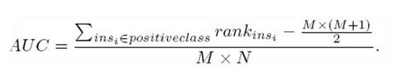
2. TIME：即分类器训练数据所花费的时间，用于评估分类器的性能  
#  分析
## 数据探索
该项目提供三份数据，训练用户数据以及测试用户数据、竞拍行为数据：
* 训练用户数据（train.csv）－为用户基础信息数据，用户ID（bidder_id）、支付账户（payment_account）、住址（address），其中还每个用户都已提前被标记了是否为机器人（outcome），可基于此数据对模型进行训练。
* 训练测试数据（test.csv）－为用户基础信息数据，尚未做机器人标记，接下来我们将对这部分用户进行判定其为机器人用户的概率。
* 竞拍行为数据（bids.csv）-平台某段时期内的所有竞拍的行为数据，纪录了每一次竞价行为的行为ID（bid_id），用户ID(bidder_id)，竞拍ID（aution），物品类型（merchandise），设备类型（device），竞拍时间（time），国家（country），IP，外链（URL），时间等等数据。我们将通过分析真实用户及机器人用户行为之间的共性与区别，找出真正的机器人用户。

首先我们先对训练用户数据进行分析

通过对数据字段含义研究发现，bidder_id为用户的唯一标示，不可重复，且没有具体规律可循，初步可以判断此特征对于分类器训练没有帮助，可考虑删除此特征。

观察训练用户数据的数据类型
| train 特征名称 | 特征类型 |
| :----: | :----: |
| bidder_id | object |
| payment_account | object |
| address | object |
| outcome | float64 |

特征数量:  4

由上表可见：
* 用户ID、付款方式、地址内容都为字符串，若要进行训练，我们需要把字符串转化为数字，以使分类器能够发挥作用。  
* 其次，训练数据的特征数量过少，不足以让我们准确识别机器人用户，我们需要通过对竞拍行为数据对每个用户的竞拍行为进行特征统计，并把其当作训练特征加入训练用户数据，用以提高预测的准确性。  


其次，再对竞拍行为数据进行分析
| bids 特征名称 | 特征类型 |
| :----: | :----: |
| bid_id | int64 |
| bidder_id | object |
| auction | object |
| merchandise | object |
| device | object |
| time | int64 |
| country | object |
| ip | object |
| url | object |

可知数据中由大量的字符串，需要都将之转变为数字再进行模型训练。

下面我们将检查每个特征值的空值数量
bid_id : 0
bidder_id : 0
auction : 0
merchandise : 0
device : 0
time : 0
country : 8859
ip : 0
url : 0
查出竞拍行为数据中，有8859条数据是没有国家数据的，我门对这些国家为空值的数据设置默认值'none'，用以当作一个独立的值进行训练。
``` python
bids['country']= bids['country'].fillna('none')
```
观察到处理后的特征空值数量
bid_id : 0
bidder_id : 0
auction : 0
merchandise : 0
device : 0
time : 0
country : 8859
ip : 0
url : 0

##  探索性可视化
#### 用户竞拍频度
接下来我们将通过可视化图形对用户行为统计特征进行进一步分析。
我们在某一auction下按照竞拍时间来画出真假用户的竞拍次数分布，图中红色分布为机器人用户，蓝色分布为真实用户。

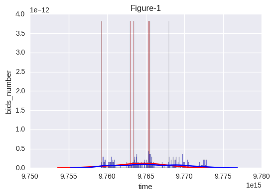

		
如图1所示，机器人用户会在集中在短时间内进行大量的竞价行为，而真实用户的行为则相对平均分布在时间线上，则我们可以把在auction下的用户平均竞价次数，最大竞价次数，平均竞价时间间隔作为统计特征进行训练。

#### 国家登录数量
接下来，我们对用户登录的国家数量分布进行分析，图2统计了每个用户在平台上登录进行竞拍的国家数量汇总。横坐标为某用户登录过的国家数量，纵坐标为次登录过对应国家数量的用户占比。红色为机器人用户，蓝色为真实用户。
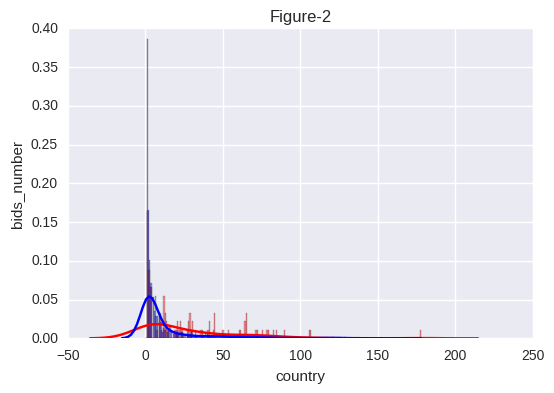

由图2可知，大量真实用户所登录过的国家不超过20个，而机器人用户登录过的国家数量分布很平缓，不够集中，大概在0～100之间，其中还有部分机器人用户登录国家超过170多个。所以我们可以根据用户登录过的国家数量统计进行特征训练。

#### 设备登录数量
接下来，我们对用户登录过的设备数量分布进行分析，图3统计了每个用户在平台上登录进行竞拍的设备数量汇总。横坐标为某用户登录过的设备类型数量，纵坐标为次登录过对应设备数量的用户占比。红色为机器人用户，蓝色为真实用户。
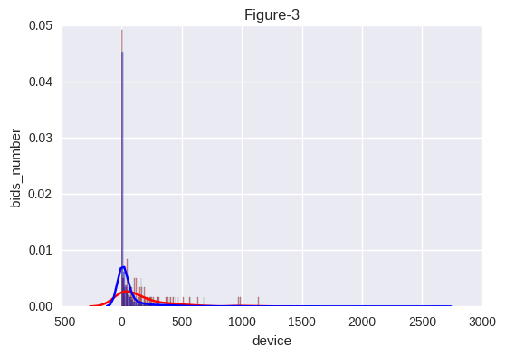

由图3可知，大量真实用户所登录过的设备不超过100个，而机器人用户登录过的设备数量分布很平缓，不够集中，大概在0～700之间，其中还有部分机器人用户登录设备数量超过1000多个。所以我们可以根据用户登录过的设备数量统计进行特征训练。

#### IP登录数量
下面，我们对平均一次竞拍活动中用户的url登录次数分布进行分析。横坐标为某用户平均一次竞拍活动中登录过的url数量，纵坐标为次登录过对应url数量的用户占比。红色为机器人用户，蓝色为真实用户。
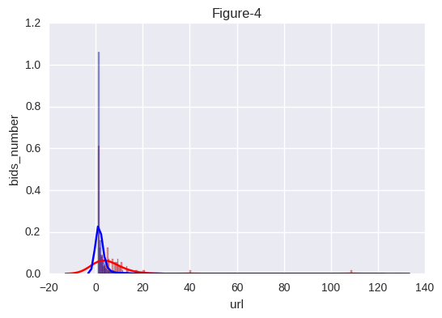

由上图可知，大量真实用户所登录的url相对集中，在10个url之内，而机器人用户登录过的url数量分布相对平缓，大概在0～20之间，其中还有部分机器人用户登录url数量超过100多个。所以我们可以根据用户登录过的url数量统计进行特征训练。

## 算法与方法
由前面分析可知，特征大部分为字符串，我们需将其转化成数值化，且某些特征字符串类型过多，如果使OneHotEncoding会造成特征维度灾难，对每个特征进行LabelEncoding[1]处理。

同时由于这些数据内部缺少相关性，对于这类二分类监督学习问题，所以我们用基于决策树当分类器来训练。决策树的优点是：可处理不相关的特征，忽略数据之间的关联性；不需要对数据归一化，数据准备相对简单；易于解释及说明；对应的缺点是：不支持在线学习，所以当有新样本时，必须要重建决策树。但在此项目中我们不会涉及到在线学习，所以可忽略。单一的决策数容易造成过拟合，所以我们将通过集成算法Boosting和Bagging来降低过拟合。在Boosting算法中，我们将采用基于Gradient Boosting的Xgboost[2]，其由于优秀的性能以及更高的准确率在已在kaggle平台获得了大量用户支持。第二是微软新出的lightgbm，同样是基于gradient boosting的boosting框架，由于其使用了Histogram算法，相比xgboost的pre-sorted算法有着更快的处理速度和更低的内存消耗[8]。以及基于Bagging算法的randomforest，其优势是如果有很大一部分的特征遗失，仍可以维持准确度，它能够处理很高维度（feature很多）的数据，并且不用做特征选择。

我们将在在3个模型中筛选出最优分类器作为最终预测分类器使用。评价分类器的指标即为上文所提AUC及Time。

### Xgboost
#### Xgboost简介:
基于Gradient Boosting的优化实现，建立多个基于cart决策树弱分类器,每一次建立模型是基于之前模型的梯度下降方向。让损失函数在梯度下降方向不断的减小，达到最优值。

xgboost相较于传统Gradient Boosting优势在于：加入了正则项，用于控制模型的复杂度，防止过拟合；传统GBDT在优化时只用到一阶导数信息，xgboost则对代价函数进行了二阶泰勒展开，同时用到了一阶和二阶导数，对损失函数做出来改进。分布式加权直方图算法[7]，提高算法训练效率；对于特征的值有缺失的样本，xgboost可以自动学习出它的分裂方向。

但由于其基于pre-sorted算法，导致每一次的迭代计算是都要遍历整个训练数据，造成了空间、时间的大量消耗。
#### xgboost参数介绍：  
XGBoost的参数可以分为三种类型：通用参数、booster参数以及学习目标参数
Parameter for Tree Booster

* eta [default=0.3] 
    - 为了防止过拟合，更新过程中用到的收缩步长。在每次提升计算之后，算法会直接获得新特征的权重。 eta通过缩减特征的权重使提升计算过程更加保守。缺省值为0.3
    - 取值范围为：[0,1]
    - 通常最后设置eta为0.01~0.2
* gamma [default=0] 
    - minimum loss reduction required to make a further partition on a leaf node of the tree. the larger, the more conservative the algorithm will be.
    - range: [0,∞]
    - 模型在默认情况下，对于一个节点的划分只有在其loss function 得到结果大于0的情况下才进行，而gamma 给定了所需的最低loss function的值
    - gamma值使得算法更conservation，且其值依赖于loss function ，在模型中应该进行调参。
* max_depth [default=6] 
    - 树的最大深度。缺省值为6
    - 取值范围为：[1,∞]
    - 指树的最大深度
    - 树的深度越大，则对数据的拟合程度越高（过拟合程度也越高）。即该参数也是控制过拟合
    - 建议通过交叉验证（xgb.cv ) 进行调参
    - 通常取值：3-10
* min_child_weight [default=1] 
    - 孩子节点中最小的样本权重和。如果一个叶子节点的样本权重和小于min_child_weight则拆分过程结束。在现行回归模型中，这个参数是指建立每个模型所需要的最小样本数。该成熟越大算法越conservative。即调大这个参数能够控制过拟合。
    - 取值范围为: [0,∞]
* max_delta_step [default=0] 
    - Maximum delta step we allow each tree’s weight estimation to be. If the value is set to 0, it means there is no constraint. If it is set to a positive value, it can help making the update step more conservative. Usually this parameter is not needed, but it might help in logistic regression when class is extremely imbalanced. Set it to value of 1-10 might help control the update
    - 取值范围为：[0,∞]
    - 如果取值为0，那么意味着无限制。如果取为正数，则其使得xgboost更新过程更加保守。
    - 通常不需要设置这个值，但在使用logistics 回归时，若类别极度不平衡，则调整该参数可能有效果
* subsample [default=1] 
    - 用于训练模型的子样本占整个样本集合的比例。如果设置为0.5则意味着XGBoost将随机的从整个样本集合中抽取出50%的子样本建立树模型，这能够防止过拟合。
    - 取值范围为：(0,1]
* colsample_bytree [default=1] 
    - 在建立树时对特征随机采样的比例。缺省值为1
    - 取值范围：(0,1]
* colsample_bylevel[default=1]
    - 决定每次节点划分时子样例的比例
    - 通常不使用，因为subsample和colsample_bytree已经可以起到相同的作用了
* scale_pos_weight[default=0]
    - A value greater than 0 can be used in case of high class imbalance as it helps in faster convergence.
    - 大于0的取值可以处理类别不平衡的情况。帮助模型更快收敛
    
    
Task Parameters

* objective [ default=reg:linear ] 
    - 定义学习任务及相应的学习目标
* base_score [ default=0.5 ] 
    - the initial prediction score of all instances, global bias
* eval_metric [ default according to objective ] 
    - 校验数据所需要的评价指标，不同的目标函数将会有缺省的评价指标（rmse for regression, and error for classification, mean average precision for ranking）
* seed [ default=0 ] 
    - 随机数的种子。缺省值为0
    - 可以用于产生可重复的结果（每次取一样的seed即可得到相同的随机划分）
    


### LightGBM
#### LightGBM简介：
LightGBM 是一个梯度 boosting 框架，基于Histogram的决策树算法。

直方图算法的基本思想是先把连续的浮点特征值离散化成k个整数，同时构造一个宽度为k的直方图。在遍历数据的时候，根据离散化后的值作为索引在直方图中累积统计量，当遍历一次数据后，直方图累积了需要的统计量，然后根据直方图的离散值，遍历寻找最优的分割点。如下图

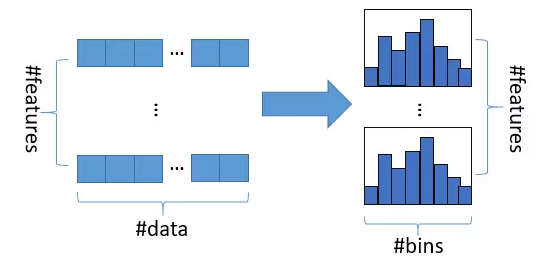


其次是深度限制的Leaf-wise的叶子生长策略，与传统的Level-wise相比，Level-wise是对同一层的叶子做无差别的分裂，造成无必要的浪费。如下图所示

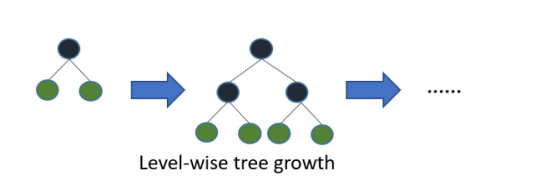


Leaf-wise是找到信息增益最大的叶子进行分裂，但又通过限制其分裂的深度降低过拟合这样可降低误差，提高精度。如下图所示

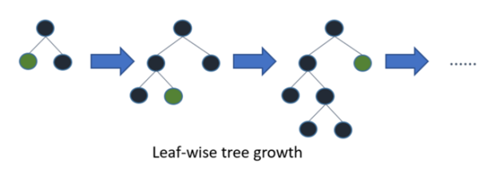


其有以下优势：
- 更快的训练效率
- 低内存使用
- 更好的准确率
- 支持并行学习
- 可处理大规模数据

#### LightGBM参数：
* num_leaves:
    - 一颗树的叶子数量
* num_iterations
    - boosting迭代次数
* learning_rate
    - 学习速率
* num_leaves
    - 一个决策树的叶子数量
* num_threads
    - 线程数量
* max_depth
    - 决策树的最大深度
    - 取值范围为：[1,∞]
* min_data_in_leaf
    - 一个叶子的最小数据数量，可以用于过拟合
* min_sum_hessian_in_leaf
    - 一片叶子的hessian之和，同样用于过拟合
* feature_fraction
    - 模型每次迭代将选取部分特征进行训练，可用于提高训练速度以及预防过拟合
* feature_fraction_seed
    - 随机种子的特征占比
* bagging_fraction
    - 类似feature_fraction，但其是每次迭代随机选择部分数据，可用于提高训练速度以及预防过拟合
* bagging_freq
    - bagging的频度
* bagging_seed
    - bagging_seed的随机种子
* early_stopping_round
    - 在第early_stopping_round轮中，一个测试数据的验证指标没有提升了，则停止训练。
* lambda_l1
    - L1正则项
* lambda_l2
    - L2正则项
* min_gain_to_split
    - 执行分裂的最小增益
    
### RandomForest
#### RandomForest简介：
随机抽取其中的m(m << M)个特征进行训练，并对结果进行输出，且其最终输出结果是由多棵树输出结果的投票决定。因为样本的抽取，特征的抽取已经保证了随机性，大大减少了overfitting的可能性。
#### RandomForest参数：
* n_estimators=10：
    - 决策树的个数，越多越好，但是性能就会越差，至少100左右（具体数字忘记从哪里来的了）可以达到可接受的性能和误差率。 
* bootstrap=True：
    - 是否有放回的采样。  
* oob_score=False：
    - oob（out of band，带外）数据，即：在某次决策树训练中没有被bootstrap选中的数据。多单个模型的参数训练，我们知道可以用cross validation（cv）来进行，但是特别消耗时间，而且对于随机森林这种情况也没有大的必要，所以就用这个数据对决策树模型进行验证，算是一个简单的交叉验证。性能消耗小，但是效果不错。  
* n_jobs=1：
    - 并行job个数。这个在ensemble算法中非常重要，尤其是bagging（而非boosting，因为boosting的每次迭代之间有影响，所以很难进行并行化），因为可以并行从而提高性能。1=不并行；n：n个并行；-1：CPU有多少core，就启动多少job
* warm_start=False：
    - 热启动，决定是否使用上次调用该类的结果然后增加新的。  
* class_weight=None：
    - 各个label的权重。  
## 基准测试
该项目为Kaggle竞赛项目之一，Private Leaderboard排名第一的auc分数为0.94。如果我们不做特征工程，不调参的情况下xgboost,lightgbm,random forest的平均预测分数在kaggle的提交分数达到了0.5。由于硬件限制，无法对大量数据进行复杂处理，我们把目标auc定为0.9以上。

# 方法
## 数据预处理
####缺失值处理
我们获取训练用户及测试用户的总用户数量、以及从竞拍行为数据中计算出参加竞拍的用户数。
测试用户数＋训练用户数： 6713
参加竞拍活动的用户数： 6614
也就是说训练和测试用户中将有部分用户没有竞拍行为数据可用来做为特征，无法用于训练。对于这部分用户的特征我们将用缺省值0填充。

####特征工程
通过对竞拍行为数据的特征统计，整理出新的特征并加入用户数据中用于训练模型，这些特征都是经过观察有对测试auc值提高的作用的。整理出的新特征有：  
* 竞拍次数
    - 每个用户一次拍卖活动中的最大竞拍次数  
    - 每个用户一次拍卖活动中的平均竞拍次数  
    - 每个用户参与的拍卖活动次数 
* 设备数量
    - 每个用户一次竞拍活动中登录过的平均设备数量  
    - 每个用户一次竞拍活动中登录过的最大设备数量  
    - 每个用户在平台上所登录过的设备数量  
* 国家数量
    - 每个用户在平台竞拍登录过的国家数量  
    - 每次竞拍活动用户平均登录的国家数量  
    - 每次竞拍活动用户最多登录的国家数量 
* IP数量
    - 每个用户一次竞拍活动中登录过平均IP数量  
    - 每个用户一次竞拍活动中登录过最大IP数量  
    - 每个用户所有竞拍活动中登录过总IP数量 
* url数量
    - 每个用户一次竞拍活动中url的登录次数  
    - 每个用户平均通过一个url的进行的竞拍次数  
* 商品类型
    - 每个用户在平台上竞拍商品类型的平均数量  


          
通过调试发现，去掉以下特征，可提高auc：
* address  
* bidder_id  


#### 特征数值化
由于用户数据存在字符串特征，我们需先将其数值化，通过labelEncoder对每一列数据进行数值化处理就，下面代码为处理数值化的具体过程。

``` python
def preprocess_features(X):
    ''' 预处理特征数据，将字符串数据数值化
    '''
    labelEncoder=None
    # 初始化一个用于输出的DataFrame
    output = pd.DataFrame(index = X.index)

    # 查看数据的每一个特征列
    for col, col_data in X.iteritems():
        
        # 如果数据类型是类别的（categorical），将它转换成虚拟变量
        if col_data.dtype == object:
            if col=='bidder_id':
                labelEncoder=LabelEncoder()
                col_data = labelEncoder.fit_transform(col_data)
            else :
                col_data = LabelEncoder().fit_transform(col_data)
            col_data=pd.DataFrame(col_data,columns=[col])
            col_data.index=X.index
        # 收集转换后的列
        output = output.join(col_data)
    return output,labelEncoder
``` 

## 实施
我们选择RandomForest、lightGBM、Xgboost三个分类器进行训练，同时也使用ensemble方法把三个分类器进行合并得到一个新的分类起，使用相同的训练数据及测试数据，并通过指标AUC及Time进行分类器评估。

** 分类器 <class 'sklearn.ensemble.forest.RandomForestClassifier'> - 0 **

| 训练集大小 | 训练时间（Time） | 预测时间 (测试) | AUC值 (训练) | AUC值 (测试) |
| :----: | :----: | :----: | :----: | :----: |
| 161 | 0.0051 | 0.0053 | 1.0000 | 0.8261 |
| 322 | 0.0051 | 0.0056 | 1.0000 | 0.7724 |
| 805 | 0.0053 | 0.0052 | 1.0000 | 0.7687 |
| 1610 | 0.0071 | 0.0056 | 0.9996 | 0.8453 |

** 分类器 <class 'lightgbm.sklearn.LGBMClassifier'> - 1 **

| 训练集大小 | 训练时间（Time） | 预测时间 (测试) | AUC值 (训练) | AUC值 (测试) |
| :----: | :----: | :----: | :----: | :----: |
| 161 | 0.0026 | 0.0056 | 0.9306 | 0.8906 |
| 322 | 0.0025 | 0.0022 | 0.9779 | 0.8685 |
| 805 | 0.0033 | 0.0022 | 0.9797 | 0.8082 |
| 1610 | 0.0035 | 0.0021 | 0.9802 | 0.8820 |

** 分类器 <class 'xgboost.sklearn.XGBClassifier'> - 2 **

| 训练集大小 | 训练时间（Time） | 预测时间 (测试) | AUC值 (训练) | AUC值 (测试) |
| :----: | :----: | :----: | :----: | :----: |
| 161 | 0.0009 | 0.0010 | 0.9988 | 0.8330 |
| 322 | 0.0079 | 0.0070 | 0.9996 | 0.7980 |
| 805 | 0.0030 | 0.0012 | 0.9992 | 0.8781 |
| 1610 | 0.0023 | 0.0011 | 0.9938 | 0.8892 |

** 分类器 <class 'sklearn.ensemble.voting_classifier.VotingClassifier'> - 3 **

| 训练集大小 | 训练时间（Time） | 预测时间 (测试) | AUC值 (训练) | AUC值 (测试) |
| :----: | :----: | :----: | :----: | :----: |
| 161 | 0.0079 | 0.0084 | 1.0000 | 0.8901 |
| 322 | 0.0082 | 0.0086 | 1.0000 | 0.8697 |
| 805 | 0.0088 | 0.0088 | 0.9995 | 0.8618 |
| 1610 | 0.0115 | 0.0087 | 0.9980 | 0.8862 |


由上方数据可见，LGBMClassifier、XGBClassifier训练时间最快，RandomForestClassifier训练时间较长。
  
在AUC值上，其次是XGBClassifier预测分数为0.8892，分数最高，其次是LGBMClassifier，分数为0.8820,最低为RandomForestClassifier，分数为0.8453。

我们也使用了ensemble方法来集成三个分类器，但其测试auc为0.8862，效果并不如XGBClassifier。

综上我们选取XGBClassifier作为最终模型。

## 改进
我将通过GridSearchCV对xgboost进行参数优化。
##### max_depth 和 min_weight 参数调优

范围： 
'max_depth':1~4
'min_child_weight':10~15

	params，test_auc
	{u'max_depth': 1, u'min_child_weight': 10}  0.907416
	{u'max_depth': 1, u'min_child_weight': 11}  0.907218
	{u'max_depth': 1, u'min_child_weight': 12}  0.906890
	{u'max_depth': 1, u'min_child_weight': 13}  0.907420
	{u'max_depth': 1, u'min_child_weight': 14}  0.907176
	{u'max_depth': 2, u'min_child_weight': 10}  0.916890
	{u'max_depth': 2, u'min_child_weight': 11}  0.917622
	{u'max_depth': 2, u'min_child_weight': 12}  0.918426
	{u'max_depth': 2, u'min_child_weight': 13}  0.915922
	{u'max_depth': 2, u'min_child_weight': 14}  0.916563
	{u'max_depth': 3, u'min_child_weight': 10}  0.916439
	{u'max_depth': 3, u'min_child_weight': 11}  0.917830
	{u'max_depth': 3, u'min_child_weight': 12}  0.918861
	{u'max_depth': 3, u'min_child_weight': 13}  0.913487
	{u'max_depth': 3, u'min_child_weight': 14}  0.915363
	{u'max_depth': 4, u'min_child_weight': 10}  0.916831
	{u'max_depth': 4, u'min_child_weight': 11}  0.917312
	{u'max_depth': 4, u'min_child_weight': 12}  0.918465
	{u'max_depth': 4, u'min_child_weight': 13}  0.916975
	{u'max_depth': 4, u'min_child_weight': 14}  0.915569
best_score:0.918861256545 
best_param:{'max_depth': 3, 'min_child_weight': 12}


##### gamma参数调优
		
范围： 
'gamma':0~10
		 
	param，test_auc
	{u'gamma': 0}  0.918861
	{u'gamma': 1}  0.917970
	{u'gamma': 2}  0.917436
	{u'gamma': 3}  0.912832
	{u'gamma': 4}  0.903827
	{u'gamma': 5}  0.899837
	{u'gamma': 6}  0.902503
	{u'gamma': 7}  0.899751
	{u'gamma': 8}  0.900419
	{u'gamma': 9}  0.899859
best_score:0.918861256545 
best_param: {'gamma': 0.0}


##### 调整subsample 和 colsample_bytree 参数

 范围：
 'subsample':0.9~1.0
 'colsample_bytree':0.65~0.75

	param，test_auc
	{u'subsample': 0.9, u'colsample_bytree': 0.65}   0.913808
	{u'subsample': 0.91, u'colsample_bytree': 0.65}  0.917121
	{u'subsample': 0.92, u'colsample_bytree': 0.65}  0.917764
	{u'subsample': 0.93, u'colsample_bytree': 0.65}  0.916103
	{u'subsample': 0.94, u'colsample_bytree': 0.65}  0.915433
	{u'subsample': 0.95, u'colsample_bytree': 0.65}  0.913328
	{u'subsample': 0.96, u'colsample_bytree': 0.65}  0.911754
	{u'subsample': 0.97, u'colsample_bytree': 0.65}  0.913379
	{u'subsample': 0.98, u'colsample_bytree': 0.65}  0.915226
	{u'subsample': 0.99, u'colsample_bytree': 0.65}  0.913890
	{u'subsample': 1.0, u'colsample_bytree': 0.65}   0.918478
	{u'subsample': 0.9, u'colsample_bytree': 0.66}   0.913808
	{u'subsample': 0.91, u'colsample_bytree': 0.66}  0.917121
	{u'subsample': 0.92, u'colsample_bytree': 0.66}  0.917764
	{u'subsample': 0.93, u'colsample_bytree': 0.66}  0.916103
	{u'subsample': 0.94, u'colsample_bytree': 0.66}  0.915433
	{u'subsample': 0.95, u'colsample_bytree': 0.66}  0.913328
	{u'subsample': 0.96, u'colsample_bytree': 0.66}  0.911754
	{u'subsample': 0.97, u'colsample_bytree': 0.66}  0.913379
	{u'subsample': 0.98, u'colsample_bytree': 0.66}  0.915226
	{u'subsample': 0.99, u'colsample_bytree': 0.66}  0.913890
	{u'subsample': 1.0, u'colsample_bytree': 0.66}   0.918478
	{u'subsample': 0.9, u'colsample_bytree': 0.67}   0.913315
	{u'subsample': 0.91, u'colsample_bytree': 0.67}  0.915216
	{u'subsample': 0.92, u'colsample_bytree': 0.67}  0.916734
	{u'subsample': 0.93, u'colsample_bytree': 0.67}  0.916481
	{u'subsample': 0.94, u'colsample_bytree': 0.67}  0.912243
	{u'subsample': 0.95, u'colsample_bytree': 0.67}  0.914678
	{u'subsample': 0.96, u'colsample_bytree': 0.67}  0.911368
	{u'subsample': 0.97, u'colsample_bytree': 0.67}  0.912030
	...                                                   ...
	{u'subsample': 0.93, u'colsample_bytree': 0.72}  0.916458
	{u'subsample': 0.94, u'colsample_bytree': 0.72}  0.912111
	{u'subsample': 0.95, u'colsample_bytree': 0.72}  0.915107
	{u'subsample': 0.96, u'colsample_bytree': 0.72}  0.913581
	{u'subsample': 0.97, u'colsample_bytree': 0.72}  0.911143
	{u'subsample': 0.98, u'colsample_bytree': 0.72}  0.912219
	{u'subsample': 0.99, u'colsample_bytree': 0.72}  0.911769
	{u'subsample': 1.0, u'colsample_bytree': 0.72}   0.916683
	{u'subsample': 0.9, u'colsample_bytree': 0.73}   0.914167
	{u'subsample': 0.91, u'colsample_bytree': 0.73}  0.916586
	{u'subsample': 0.92, u'colsample_bytree': 0.73}  0.915662
	{u'subsample': 0.93, u'colsample_bytree': 0.73}  0.916458
	{u'subsample': 0.94, u'colsample_bytree': 0.73}  0.912111
	{u'subsample': 0.95, u'colsample_bytree': 0.73}  0.915107
	{u'subsample': 0.96, u'colsample_bytree': 0.73}  0.913581
	{u'subsample': 0.97, u'colsample_bytree': 0.73}  0.911143
	{u'subsample': 0.98, u'colsample_bytree': 0.73}  0.912219
	{u'subsample': 0.99, u'colsample_bytree': 0.73}  0.911769
	{u'subsample': 1.0, u'colsample_bytree': 0.73}   0.916683
	{u'subsample': 0.9, u'colsample_bytree': 0.74}   0.914167
	{u'subsample': 0.91, u'colsample_bytree': 0.74}  0.916586
	{u'subsample': 0.92, u'colsample_bytree': 0.74}  0.915662
	{u'subsample': 0.93, u'colsample_bytree': 0.74}  0.916458
	{u'subsample': 0.94, u'colsample_bytree': 0.74}  0.912111
	{u'subsample': 0.95, u'colsample_bytree': 0.74}  0.915107
	{u'subsample': 0.96, u'colsample_bytree': 0.74}  0.913581
	{u'subsample': 0.97, u'colsample_bytree': 0.74}  0.911143
	{u'subsample': 0.98, u'colsample_bytree': 0.74}  0.912219
	{u'subsample': 0.99, u'colsample_bytree': 0.74}  0.911769
	{u'subsample': 1.0, u'colsample_bytree': 0.74}   0.916683
best_score:0.918477918329 
best_param:{'subsample': 1.0, 'colsample_bytree': 0.65}

##### 调整 reg_alpha 参数

 范围：
 'reg_alpha':0~0.39

	param，test_auc
	{u'reg_alpha': 0.3}   0.915894
	{u'reg_alpha': 0.31}  0.917254
	{u'reg_alpha': 0.32}  0.919465
	{u'reg_alpha': 0.33}  0.918825
	{u'reg_alpha': 0.34}  0.918041
	{u'reg_alpha': 0.35}  0.917187
	{u'reg_alpha': 0.36}  0.919269
	{u'reg_alpha': 0.37}  0.918097
	{u'reg_alpha': 0.38}  0.919506
	{u'reg_alpha': 0.39}  0.920227
best_score:0.920226876091 
best_param: {'reg_alpha': 0.39}

##### 调整 learning_rate 参数

范围：
'learning_rate':0~0.14

	param，test_auc
	{u'learning_rate': 0.0}   0.500000
	{u'learning_rate': 0.01}  0.895023
	{u'learning_rate': 0.02}  0.898373
	{u'learning_rate': 0.03}  0.900304
	{u'learning_rate': 0.04}  0.904043
	{u'learning_rate': 0.05}  0.912312
	{u'learning_rate': 0.06}  0.913301
	{u'learning_rate': 0.07}  0.917432
	{u'learning_rate': 0.08}  0.918432
	{u'learning_rate': 0.09}  0.917465
	{u'learning_rate': 0.1}   0.920227
	{u'learning_rate': 0.11}  0.917387
	{u'learning_rate': 0.12}  0.914916
	{u'learning_rate': 0.13}  0.916874
	{u'learning_rate': 0.14}  0.918149
best_score:0.920226876091 
best_param: {'learning_rate': 0.1}


# 结果
## 模型评估与验证
其次我们将展示模型参数learning_rate对模型分数及方差偏差的影响。
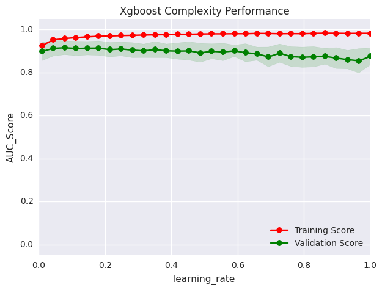

如图可知，learning_rate在0.1之前auc随着learning_rate的升高而升高，存在较小的偏差。到达01之后，随着learning_rate继续提高，训练auc与测试auc差距逐渐变大，测试auc越来越小，方差越来越高。可见learning_rate=0.1时方差最小，偏差相对较小，是最优参数。

下面我们将展现不同的训练集对测试auc及练auc的影响
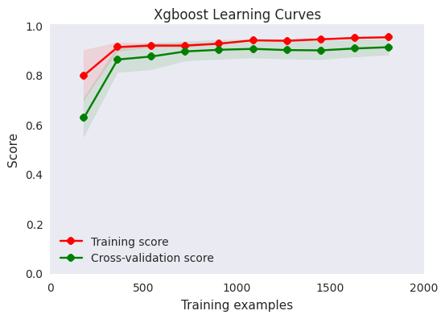

从上图中可看到，auc分数初期随着训练集数量增多而提高，方差较小，训练集到达600左右开始趋于稳定。此时的训练auc与测试auc方差变小，偏差随着训练集合的增多而降低。


## 理由
我们在kaggle提交的最终分数私榜分数为0.921，达到了我们的预期。
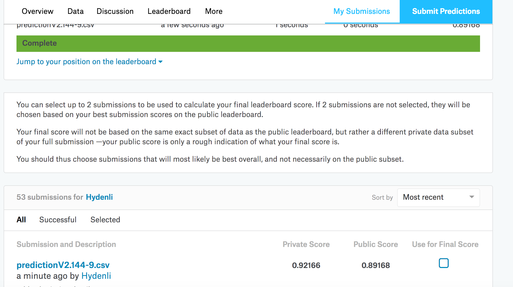


# 结论
## 自由形态的可视化
我们统计了机器人和真实用户按照按时间分布的竞拍次数，呈现在下图中，从图中可见，竞拍集中在三个时间段内，其他时间段内都没有竞拍行为，有两种可能性，一为网站的竞拍活动有周期性，有时间间隔。二为网站提供的数据经过了认为的筛选处理过。
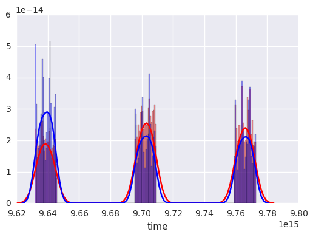

放大观察其中一个时间段，蓝色为真实用户，红色为机器人用户，从曲线分布中可看到真是用户竞拍行为有明显的周期性，可能是与生活作息有关。相较之下机器人的行为分布曲线很平缓。
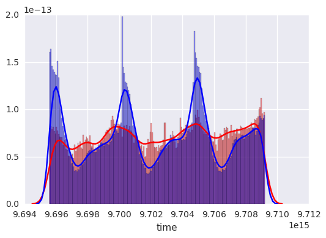


下面我们将列出xgboost模型中影响最高的特征。下图中可见，影响力最高的前三个特征分别是：'每个用户平均通过一个url的进行的竞拍次数'、‘每个用户一次拍卖中的平均竞拍次数’、'每个用户在平台上竞拍商品类型的平均数量'。可见用户的操作频度是区分真实用户与机器人用户的关键指标。
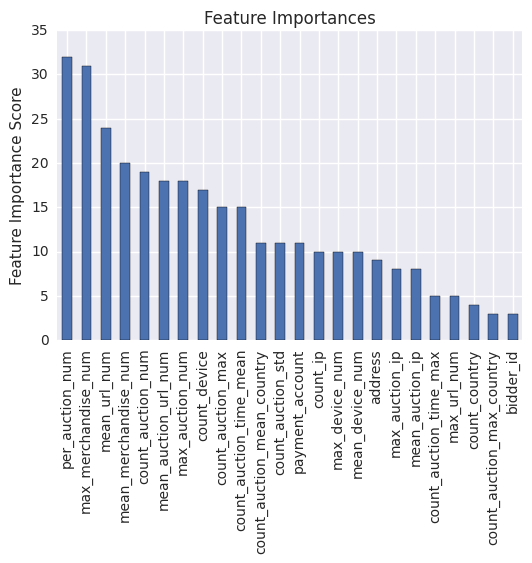

## 思考
这个项目中，用户训练数据的样本数及特征数都很有限，有限的训练数据没法做好模型训练，但是平台提供了大量的竞拍行为数据，所以次项目的核心为特征工程，即是如何充分的对竞拍行为数据进行特征统计，为训练数据提供有效的特征，提高预测的准确性。

另外本项目中大量的数据都以字符串为格式，所以需要我们做好前期的特征变换工作，把字符串数据转化为可训练的数值数据。
## 改进
由于硬件性能所限，无法对竞拍行为数据进行大规模运算，通过之前的图形分析我们知道，真实用户的操作对比机器人用户会呈现出很强的周期性，如果用户的操作进行时间周期上的统计，是能够进一步提高模型的准确性的。

另外，我们把用户特征’地址‘剔除掉了，没有利用上，如果我们这些特征进行进一步的分析，可进一步提高模型表现。
# 引用
[1] Kaggle: https://www.kaggle.com/c/facebook-recruiting-iv-human-or-bot

[2] LabelEncoding: http://scikit-learn.org/stable/modules/generated/sklearn.preprocessing.LabelEncoder.html  
  
[3] Xgboost: http://xgboost.readthedocs.io/en/latest/  
  
[4] LightGBM: https://github.com/Microsoft/LightGBM/wiki/Experiments

[5] RandomForest: https://zh.wikipedia.org/wiki/%E9%9A%8F%E6%9C%BA%E6%A3%AE%E6%9E%97

[6] Gradient Boosting: https://en.wikipedia.org/wiki/Gradient_boosting

[7] 分布式加权直方图算法: http://blog.csdn.net/sb19931201/article/details/52557382

[8] LightGBM介绍: http://www.jianshu.com/p/48e82dbb142b